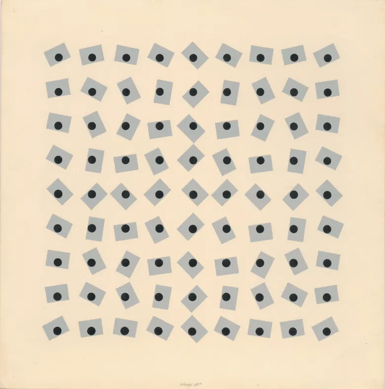
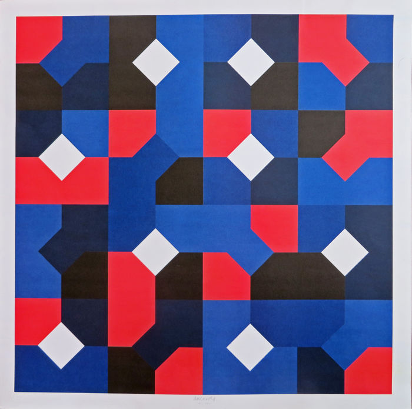
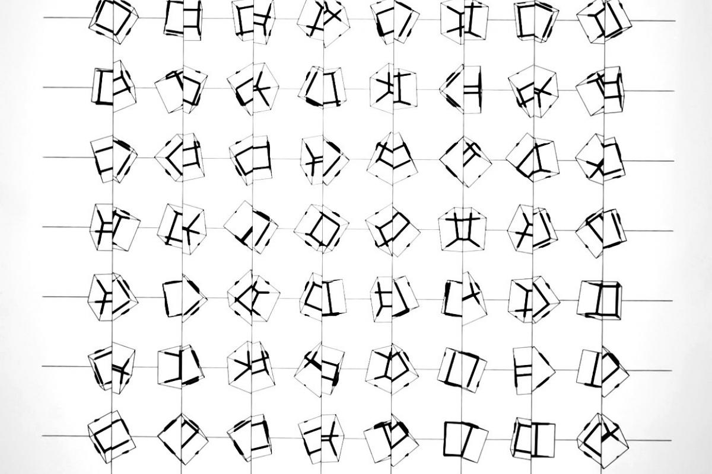
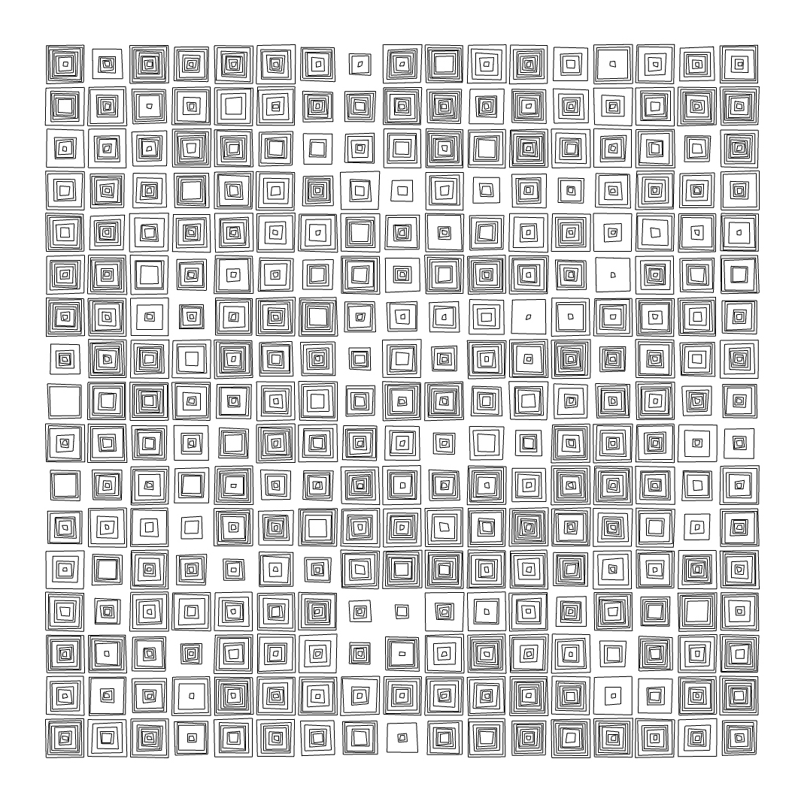

### matriz
secuencias y patterns  

***

#### referencias e iconografía
[Julio Le Parc](https://it.wikipedia.org/wiki/Julio_Le_Parc)  
Bruno Munari [curve di Peano](https://www.google.com/search?q=munari+peano+curve&sxsrf=ALeKk03xhLYpOSdM-kQADgK-tqQqil0LYg:1615458040374&source=lnms&tbm=isch&sa=X&ved=2ahUKEwjkjJWVgqjvAhUUQEEAHUnhAKEQ_AUoAXoECA8QAw&cshid=1615458070957279&biw=1280&bih=798)  
[Armin Hofmann](https://en.wikipedia.org/wiki/Armin_Hofmann)  
[Vera Molnár](https://en.wikipedia.org/wiki/Vera_Moln%C3%A1r)  
[Manfred Mohr](https://en.wikipedia.org/wiki/Manfred_Mohr)  
[Georg Nees](https://en.wikipedia.org/wiki/Georg_Nees)  
[Arte Cinetica](https://it.wikipedia.org/wiki/Arte_cinetica)  

***

